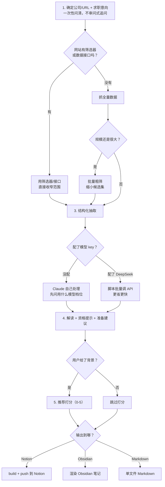
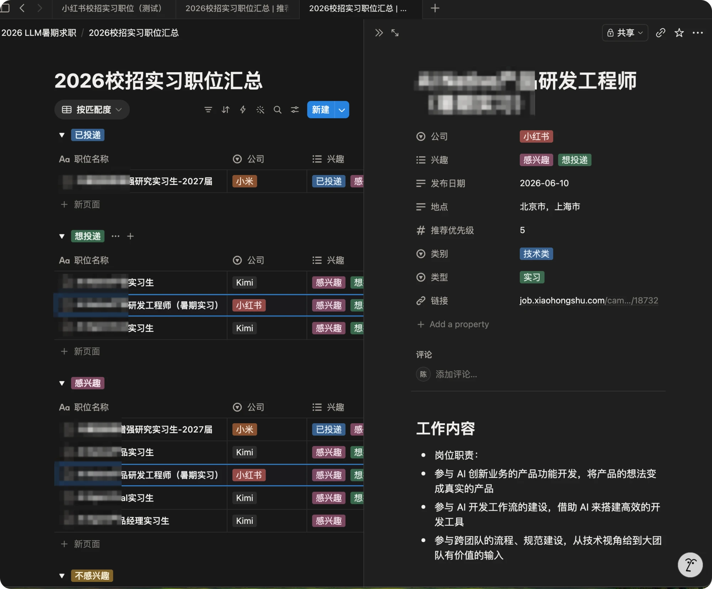

# campus-job-db

A [Claude Code](https://github.com/anthropics/claude-code) skill that turns any company's campus/social recruitment listing page into a structured, filterable job database — zero pip dependencies, pure Python standard library.

把任何公司的校招/社招职位列表页，自动变成结构化、可筛选排序的职位库：抓取 → 结构化 → 职位解读 + 资格提示 + 准备建议 → （可选）按你的背景打推荐优先级 → 输出到 Notion 数据库 / Obsidian 笔记库 / 单文件 Markdown。

所有脚本**零 pip 依赖**，只用 Python 标准库（`urllib`/`json`/`argparse`）。装好 Python 3（macOS/大多数 Linux 自带）和 Claude Code 就能跑，不需要 `pip install` 任何东西。

## 安装

```bash
git clone https://github.com/cyw6130/campus-job-db ~/.claude/skills/campus-job-db
```

只想在某个项目里用，放进项目根目录的 `.claude/skills/campus-job-db` 也可以，只对该项目生效。

装完新开一个 Claude Code 对话，它会自动识别这个 skill，不需要额外注册步骤。

## 快速开始

在 Claude Code 里把**招聘页链接（或公司名）连同你的求职背景**一起给它，一句话说清楚：

> 帮我抓 XX公司 的校招实习职位，整理成职位库。我是2027届，对XX方向感兴趣，技能背景是XX。

为什么背景信息要在一开始就给：它的作用不是事后筛选，是在**抓取阶段**就帮 Claude 用网站自带的类别筛选器/搜索参数把范围收窄，而不是抓全量数据再筛。这条踩过真实的坑——曾经抓某招聘站，网站本身就有类别筛选器，但因为没在抓取前用上求职背景，直接抓了全量 247 条，事后才用模型筛出 21 条相关的，剩下 226 条的抓取和存储全白费。背景信息缺得越早问清楚，省得越多。

Claude 会先跑环境自检（`scripts/check_setup.sh`），然后按下面的流程往下走，过程中只在必要的地方问你（比如没配模型 key 时问你想用哪个档位）。

## 它在做什么（流程概览）



批量粗筛是范围收不窄时的退路，不是默认动作——之前真踩过这个坑：某次全量抓了247条，事后才用模型筛出21条相关的，226条白抓了。没配模型 key 也不等于功能缺失，默认就是换成执行 skill 的 Claude 自己处理这几步（见上面"关于模型 key"一节）。

完整细节——每一步具体用哪个脚本、怎么处理几百条规模的数据、怎么找到网站自己的数据接口直连而不用碰浏览器——都写在 [`SKILL.md`](SKILL.md) 里。那份文档是给 Claude 看的操作手册，但写得足够清楚，人也能直接读懂整套方法论。

## 关于模型 key：没配不等于功能缺失

第 3/4/5 步（结构化抽取、职位解读+资格提示+准备建议、推荐打分）本质上是语义判断和文字生成。执行这个 skill 的 Claude 本身就有这个能力，不需要靠外部 API key 才能"解锁"。

| 情况 | 默认行为 |
|---|---|
| 没配任何模型 key | Claude 会先问你想用哪个模型档位处理这几步（比如更省 token 的 haiku，还是更高质量的档位），然后直接用自己的能力完成结构化+解读+打分，结果跟走 API 一样完整 |
| 配了 `DEEPSEEK_API_KEY`（或任何 OpenAI 兼容 key） | 这几步改走脚本的批量 API 调用，更快更便宜，适合职位数量大的场景 |
| 你明确说"不需要任何 AI 处理，纯规则切就行" | 退到 `extract_jobs.py --no-model` 的零语义兜底——没有解读/建议/打分，只做最基础的格式整理。这是你主动选择的极端情况，不是没配 key 的默认后果 |

也就是说，`DEEPSEEK_API_KEY` 是一个**可选的效率优化**，不是功能开关。没配它，Claude 自己一条条/一批批处理；配了，脚本批量调外部 API 处理——两条路产出的结果质量同等完整。

## 输出目标需要什么

| 输出到 | 需要什么 | 没配会怎样 |
|---|---|---|
| Notion 数据库 | Claude Code 里连好 Notion 集成 + 一个 Notion internal integration secret（环境变量 `NOTION_API_TOKEN`，去 [notion.com/my-integrations](https://www.notion.com/my-integrations) 创建，并在目标数据库的 Connections 里手动连接它） | 改用 Obsidian 或 Markdown |
| Obsidian 笔记库 | 一个装了 Bases 插件的 vault | 改用 Markdown |
| 单文件 Markdown | 不需要任何配置 | 永远能用，零依赖兜底 |

Notion 输出效果（按匹配度分组、推荐优先级打分、点开看结构化后的完整职位信息）：



## 脚本一览

`scripts/` 下每个脚本都能单独跑（`python3 <script>.py --help` 看参数），但正常使用不需要你自己调——跟 Claude 说清楚需求，它会照 `SKILL.md` 的流程自己选脚本、传参数、串起整条流水线。

| 脚本 | 干什么 |
|---|---|
| `check_setup.sh` | 环境自检，永远第一步先跑这个 |
| `fetch_api_paginated.py` | 找到网站数据接口后，直连翻页拉全量数据 |
| `split_jobs_from_raw.py` | 没有数据接口、靠抓原始文本时，识别职位边界并结构化 |
| `structure_from_api.py` | 数据接口返回的内容已经干净时，跳过拆分，直接结构化 |
| `extract_jobs.py` | 输入已经是预先分好的职位文本时用，带 `--no-model` 零依赖兜底模式 |
| `prefilter_large_batch.py` | 抓取阶段没能收窄范围、数据规模大时，批量粗筛缩小范围——是收窄范围失败后的退路，不是默认动作 |
| `interpret_jobs.py` | 生成职位解读 + 资格提示 + 准备建议 |
| `recommend_priority.py` | 按你的背景给每个职位打 0–5 分推荐优先级 |
| `render_markdown.py` | 渲染成单文件 Markdown 或 Obsidian 笔记 |
| `build_notion_pages.py` | 组装 Notion 页面数据（支持 `--company` 给多公司汇总库打标签） |
| `push_notion_pages.py` | 直连 Notion REST API 批量写入，写入前自动按链接去重 |

## 关于 SKILL.md 里提到的"专门的子 agent"

`SKILL.md` 里有几处提到"如果你配置了专门的子 agent（比如本作者自用的 searcher/toolbox）"——那是原作者自己机器上的私人配置，是**可选的效率优化**，不是这个 skill 的依赖项。没有这些子 agent，Claude 会自动照普通方式直接完成同样的工作，不影响功能。

## License

MIT，见 [LICENSE](LICENSE)。
